# 🚀 CodeCrux — Competitive Programming Companion

**CodeCrux,CompeCompetitive Programming Portal is a customized full-stack web application that brings together competitive programming features in a single platform. From personalized problem recommendations to daily streaks and calendar-synced contests, it integrates multiple services like Codeforces, AtCoder, LeetCode, and Clist.by into a single competitive programming hub.


---

## Features

* **User Authentication:** Secure login system to track individual user progress and preferences.
* **Contest Aggregation:** Displays upcoming contests from various platforms (Codeforces, AtCoder, LeetCode, CodeChef, GeeksForGeeks) using APIs like Clist.by.
* **Google Calendar Integration:** Allows users to add contest reminders directly to their Google Calendar.
* **Personalized Problem Lists:** Shows unsolved problems tailored to the user.
* **Problem Search & Filtering:**
    * Search by problem title or ID.
    * Filter problems by tags (e.g., dynamic programming, graphs, data structures).
    * Filter problems by difficulty level.
* **Favorites List:** Users can add preferred problems and contests to a dedicated favorites list.
* **Daily Problem Streak:**
    * Suggests a random problem daily to logged-in users.
    * Solving the daily problem maintains the user's streak.
    * The streak resets to 0 if the daily problem isn't solved by the end of the day.
* **Links to Original Problems:** Provides direct links to problems on their respective host sites.

---

## 🛠️ Tech Stack

* **Frontend:** React.js 
* **Backend:** Node.js, Express.js 
* **Database:** MongoDB with Mongoose
* **APIs:**
    * Clist.by API (for contest aggregation)
    * Official APIs from Codeforces, AtCoder, LeetCode, CodeChef, GeeksForGeeks (where available)
* **Package Managers:** npm or yarn

---

## 📁 Folder Structure

The project is organized into two main directories: `backend_` and `front_end`.
```
CP_PORTAL/
├── backend/
│ ├── controllers/
│ │ ├── authController.js
│ │ ├── contestController.js
│ │ ├── dailyChallengeController.js
│ │ ├── dashController.js
│ │ ├── favoritesController.js
│ │ ├── problemListController.js
│ │ ├── syncController.js
│ ├── middleware/
│ │ ├── authMiddleware.js
│ │ ├── errorHandler.js
│ ├── models/
│ │ ├── user.js
│ │ ├── contest.js
│ │ ├── dailyChallenge.js
│ │ ├── favorites.js
│ │ ├── problemList.js
│ │ ├── solvedProblem.js
│ ├── routes/
│ │ ├── authRoutes.js
│ │ ├── contestRoutes.js
│ │ ├── dailyChallengeRoutes.js
│ │ ├── dashboardRoutes.js
│ │ ├── favoritesRoutes.js
│ │ ├── problemListRoutes.js
│ │ ├── syncRoutes.js
│ ├── services/
│ ├── scripts/
│ ├── utils/
│ ├── config/
│ ├── server.js
│ └── .env
│
├── frontend/
│ ├── public/
│ │ └── index.html
│ ├── src/
│ │ ├── api/
│ │ │ └── apiService.js
│ │ ├── assets/
│ │ ├── components/
│ │ │ ├── ContestCard/
│ │ │ │ ├── ContestCard.jsx
│ │ │ │ └── ContestCard.css
│ │ │ ├── Navbar/
│ │ │ │ ├── Navbar.jsx
│ │ │ │ └── Navbar.css
│ │ │ ├── ProblemCard/
│ │ │ │ ├── ProblemCard.jsx
│ │ │ │ └── ProblemCard.css
│ │ │ ├── StreakCard/
│ │ │ │ ├── StreakCard.jsx
│ │ │ │ └── StreakCard.css
│ │ │ └── ProtectedRoute.jsx
│ │ ├── context/
│ │ │ └── AuthContext.jsx
│ │ ├── pages/
│ │ │ ├── Auth/
│ │ │ │ ├── AuthPage.jsx
│ │ │ │ └── AuthPage.css
│ │ │ ├── Contests/
│ │ │ │ ├── Contests.jsx
│ │ │ │ └── Contests.css
│ │ │ ├── DailyChallenge/
│ │ │ │ ├── DailyChallenge.jsx
│ │ │ │ └── DailyChallenge.css
│ │ │ ├── Dashboard/
│ │ │ │ ├── Dashboard.jsx
│ │ │ │ └── Dashboard.css
│ │ │ ├── Favorite/
│ │ │ │ ├── Favorites.jsx
│ │ │ │ ├── Favorites.css
│ │ │ │ └── sampleData.js
│ │ │ ├── ProblemList/
│ │ │ │ ├── ProblemList.jsx
│ │ │ │ └── ProblemList.css
│ │ │ ├── Profile/
│ │ │ │ ├── ProfilePage.jsx
│ │ │ │ └── ProfilePage.css
│ │ ├── styles/
│ │ │ └── index.css
│ │ ├── utils/
│ │ ├── App.jsx
│ │ ├── App.css
│ │ └── index.jsx
│ ├── .env
│ ├── package.json
│ └── yarn.lock

```

## ⚙️ Setup and Installation

1.  **Clone the repository:**
    ```bash
    git clone <repository-url>
    cd <repository-name>
    ```

2.  **Backend Setup:**
    ```bash
    cd backend_
    npm install  # or yarn install
    # Create a .env file based on .env.example (if provided) and fill in necessary environment variables (API keys, database URI, etc.)
    npm start    # or yarn start (or npm run dev / yarn dev depending on package.json scripts)
    ```

3.  **Frontend Setup:**
    ```bash
    cd ../front_end
    npm install  # or yarn install
    # Create a .env file if needed for frontend environment variables (e.g., backend API URL)
    npm start    # or yarn start
    ```

4.  Open your browser and navigate to `http://localhost:3000` (or the port specified for the frontend).

---

## 🚀 Usage

1.  **Register/Login:** Create an account or log in to access personalized features.
2.  **View Contests:** Check the "Contests" page for upcoming competitions. Add them to your Google Calendar.
3.  **Practice Problems:** Go to the "Problems" page to find unsolved problems. Use filters to narrow down your search.
4.  **Daily Challenge:** Solve the daily suggested problem to maintain your streak.
5.  **Favorites:** Add interesting problems or contests to your favorites for quick access.

---

## 🌐 APIs Used

* **Clist.by:** For aggregating contest information from multiple platforms.
* **Platform Specific APIs:** (e.g., Codeforces API, etc.) for fetching problem details, user-specific data if available and permissible.

---
## Project Overview


### Login 
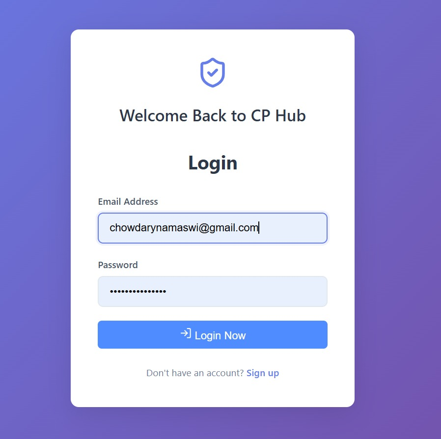

### SignUp
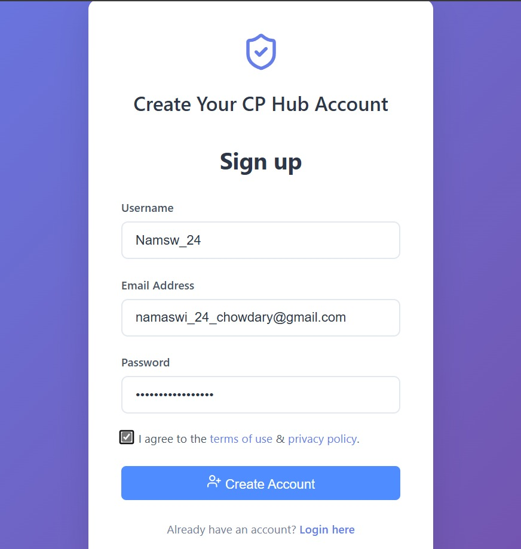

### Dashboard
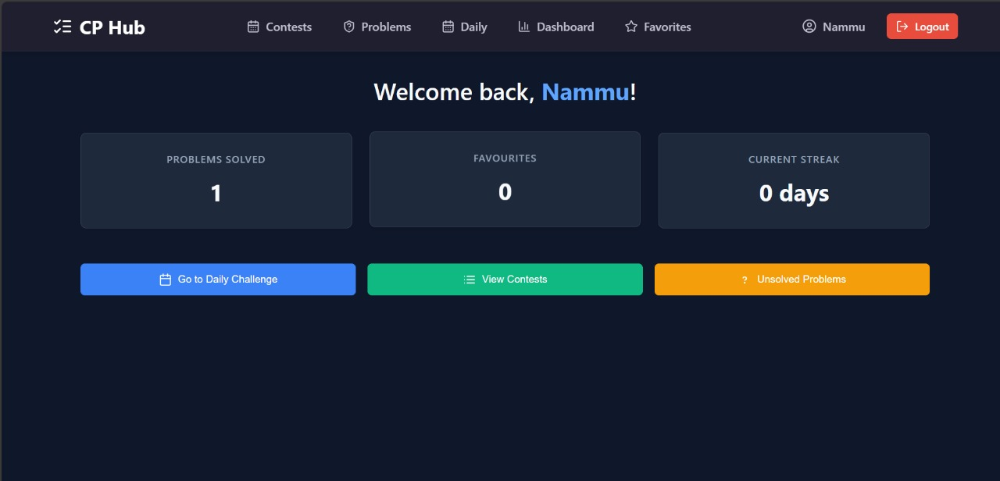

### Daily Problem
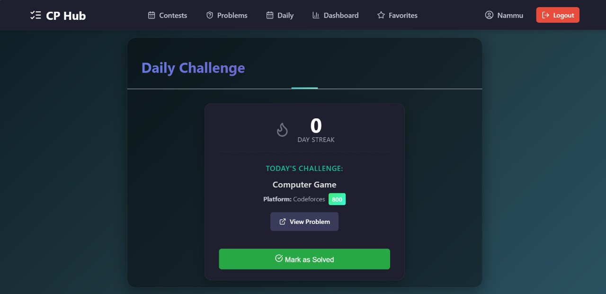

### Completing Daily Challenge
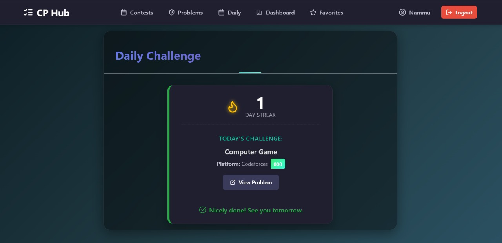


### Updated Dashboard
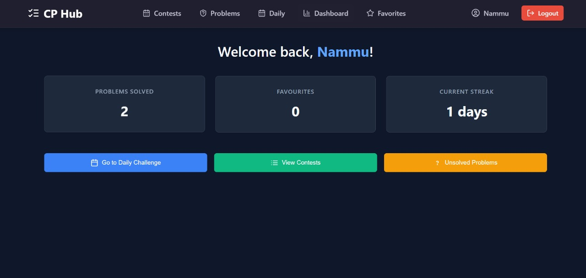


### Problem List


### Filters
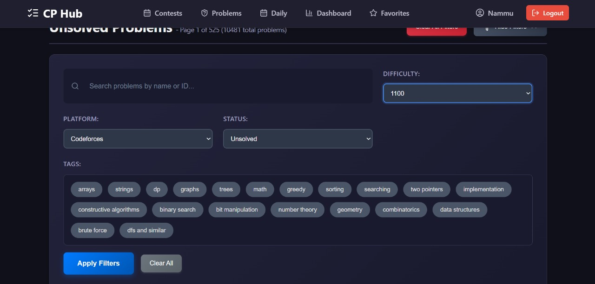

### After Applying Filters
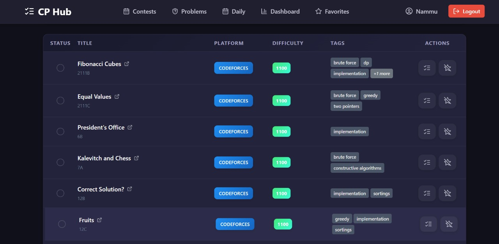

### Marking as solved and adding to favorites
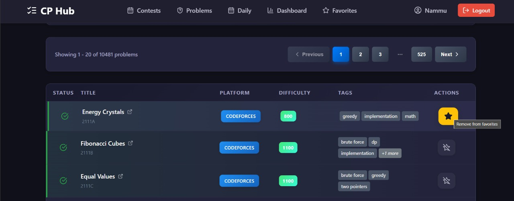

### Contests
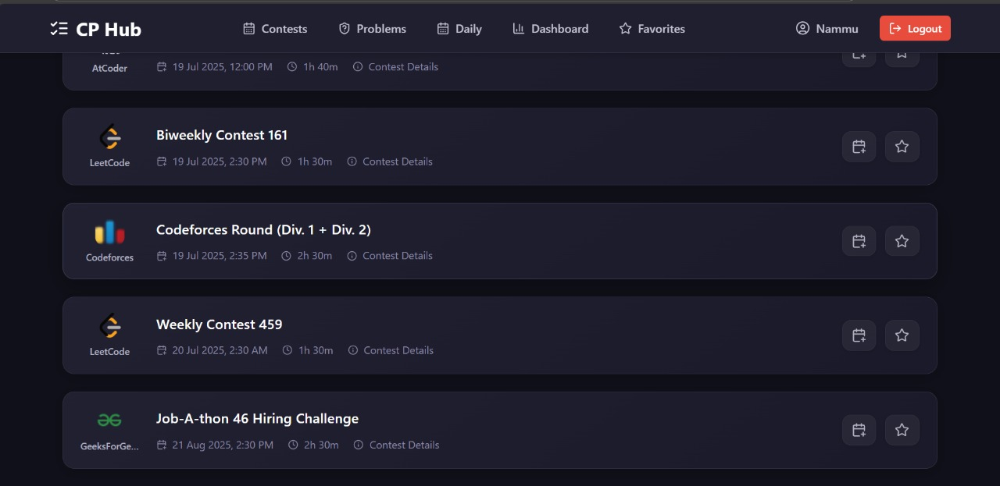

### favorites
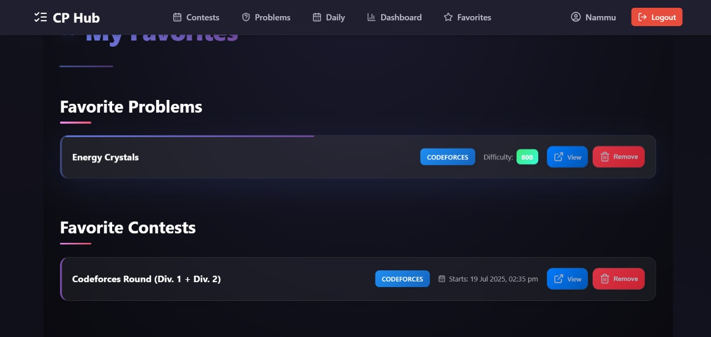

### Adding to google Calender
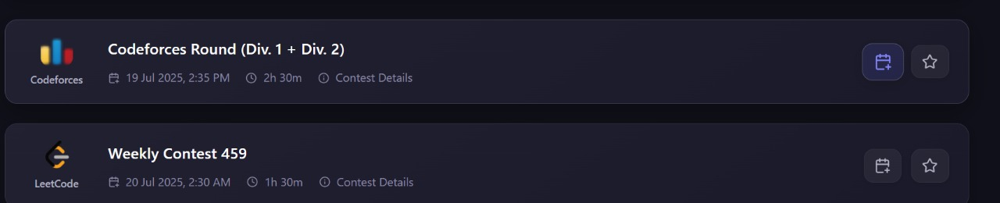

### Adding to google Calender
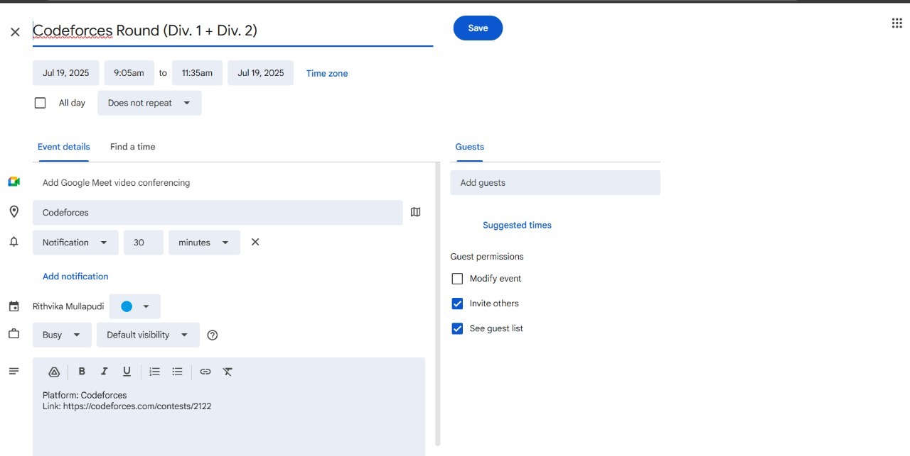

### User
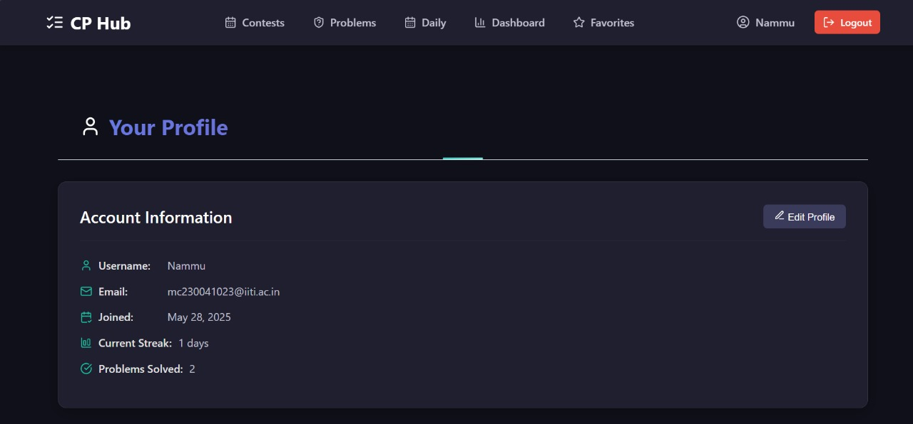


