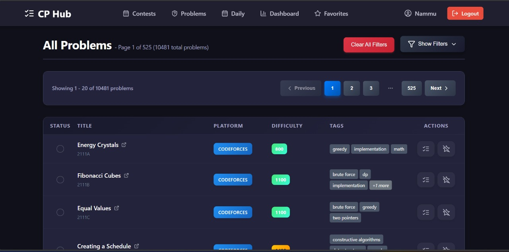

# 🚀 CodeCrux — Competitive Programming Companion

CodeCrux, CompeCompetitive Programming Portal is a customized full-stack web application that brings together competitive programming features in a single platform. From personalized problem recommendations to daily streaks and calendar-synced contests, it integrates multiple services like Codeforces, AtCoder, LeetCode, and Clist.by into a single competitive programming hub.


---

## Features

* **User Authentication:** Secure login system to track individual user progress and preferences.
* **Contest Aggregation:** Displays upcoming contests from various platforms (Codeforces, AtCoder, LeetCode, CodeChef, GeeksForGeeks) using APIs like Clist.by.
* **Google Calendar Integration:** Allows users to add contest reminders directly to their Google Calendar.
* **Personalized Problem Lists:** Shows unsolved problems tailored to the user.
* **Problem Search & Filtering:**
    * Search by problem title or ID.
    * Filter problems by tags (e.g., dynamic programming, graphs, data structures).
    * Filter problems by difficulty level.
* **Favorites List:** Users can add preferred problems and contests to a dedicated favorites list.
* **Daily Problem Streak:**
    * Suggests a random problem daily to logged-in users.
    * Solving the daily problem maintains the user's streak.
    * The streak resets to 0 if the daily problem isn't solved by the end of the day.
* **Links to Original Problems:** Provides direct links to problems on their respective host sites.

---

## 🛠️ Tech Stack

* **Frontend:** React.js 
* **Backend:** Node.js, Express.js 
* **Database:** MongoDB with Mongoose
* **APIs:**
    * Clist.by API (for contest aggregation)
    * Official APIs from Codeforces, AtCoder, LeetCode, CodeChef, GeeksForGeeks (where available)
* **Package Managers:** npm or yarn

---

## 📁 Folder Structure

The project is organized into two main directories: `backend_` and `front_end`.
```
CP_PORTAL/
├── backend/
│ ├── controllers/
│ │ ├── authController.js
│ │ ├── contestController.js
│ │ ├── dailyChallengeController.js
│ │ ├── dashController.js
│ │ ├── favoritesController.js
│ │ ├── problemListController.js
│ │ ├── syncController.js
│ ├── middleware/
│ │ ├── authMiddleware.js
│ │ ├── errorHandler.js
│ ├── models/
│ │ ├── user.js
│ │ ├── contest.js
│ │ ├── dailyChallenge.js
│ │ ├── favorites.js
│ │ ├── problemList.js
│ │ ├── solvedProblem.js
│ ├── routes/
│ │ ├── authRoutes.js
│ │ ├── contestRoutes.js
│ │ ├── dailyChallengeRoutes.js
│ │ ├── dashboardRoutes.js
│ │ ├── favoritesRoutes.js
│ │ ├── problemListRoutes.js
│ │ ├── syncRoutes.js
│ ├── services/
│ ├── scripts/
│ ├── utils/
│ ├── config/
│ ├── server.js
│ └── .env
│
├── frontend/
│ ├── public/
│ │ └── index.html
│ ├── src/
│ │ ├── api/
│ │ │ └── apiService.js
│ │ ├── assets/
│ │ ├── components/
│ │ │ ├── ContestCard/
│ │ │ │ ├── ContestCard.jsx
│ │ │ │ └── ContestCard.css
│ │ │ ├── Navbar/
│ │ │ │ ├── Navbar.jsx
│ │ │ │ └── Navbar.css
│ │ │ ├── ProblemCard/
│ │ │ │ ├── ProblemCard.jsx
│ │ │ │ └── ProblemCard.css
│ │ │ ├── StreakCard/
│ │ │ │ ├── StreakCard.jsx
│ │ │ │ └── StreakCard.css
│ │ │ └── ProtectedRoute.jsx
│ │ ├── context/
│ │ │ └── AuthContext.jsx
│ │ ├── pages/
│ │ │ ├── Auth/
│ │ │ │ ├── AuthPage.jsx
│ │ │ │ └── AuthPage.css
│ │ │ ├── Contests/
│ │ │ │ ├── Contests.jsx
│ │ │ │ └── Contests.css
│ │ │ ├── DailyChallenge/
│ │ │ │ ├── DailyChallenge.jsx
│ │ │ │ └── DailyChallenge.css
│ │ │ ├── Dashboard/
│ │ │ │ ├── Dashboard.jsx
│ │ │ │ └── Dashboard.css
│ │ │ ├── Favorite/
│ │ │ │ ├── Favorites.jsx
│ │ │ │ ├── Favorites.css
│ │ │ │ └── sampleData.js
│ │ │ ├── ProblemList/
│ │ │ │ ├── ProblemList.jsx
│ │ │ │ └── ProblemList.css
│ │ │ ├── Profile/
│ │ │ │ ├── ProfilePage.jsx
│ │ │ │ └── ProfilePage.css
│ │ ├── styles/
│ │ │ └── index.css
│ │ ├── utils/
│ │ ├── App.jsx
│ │ ├── App.css
│ │ └── index.jsx
│ ├── .env
│ ├── package.json
│ └── yarn.lock

```

## ⚙️ Setup and Installation

1.  **Clone the repository:**
    ```bash
    git clone <repository-url>
    cd <repository-name>
    ```

2.  **Backend Setup:**
    ```bash
    cd backend_
    npm install  # or yarn install
    # Create a .env file based on .env.example (if provided) and fill in necessary environment variables (API keys, database URI, etc.)
    npm start    # or yarn start (or npm run dev / yarn dev depending on package.json scripts)
    ```

3.  **Frontend Setup:**
    ```bash
    cd ../front_end
    npm install  # or yarn install
    # Create a .env file if needed for frontend environment variables (e.g., backend API URL)
    npm start    # or yarn start
    ```

4.  Open your browser and navigate to `http://localhost:3000` (or the port specified for the frontend).

```
🚀 Usage
🧾 User Registration & Authentication:

Users can securely register and log in to create their personalized programming workspace.

Authenticated sessions are managed using JWT tokens, ensuring secure and persistent access.

📅 Real-Time Contest Tracking:

Navigate to the "Contests" section to explore upcoming contests from Codeforces, AtCoder, LeetCode, CodeChef, and GFG, aggregated using the Clist.by API.

Apply advanced filters like contest duration, platform, and start time.

One-click integration with Google Calendar lets users set personalized contest reminders.

📚 Intelligent Problem Practice:

Access a curated list of unsolved problems tailored to your skill level and previous activity.

Use powerful filtering options:

By tags: e.g., dynamic programming, greedy, graph, trees.

By difficulty level, platform, or problem status (solved/unsolved).

By title keyword or problem ID.

🔥 Daily Challenge with Streak System:

Receive a daily problem based on your performance and tag preferences.

Track your daily streak visually on the dashboard.

Failure to solve the daily problem by midnight resets the streak.

✅ Problem Status & Progress Tracker:

The portal maintains a history of all solved and attempted problems.

Users can revisit:

All solved problems.

Unsolved or skipped problems.

Favorite problems they marked for later.

❤️ Favorites System:

Bookmark problems or contests to revisit later.

Favorites are stored per user and displayed on the dashboard for quick access.

📊 Dashboard & User Analytics:

View your current streak, problem-solving stats, and platform usage breakdown.

Monitor your growth over time with a progress indicator.

🔐 User Profile & Data Persistence:

Each user’s data (solved problems, streaks, favorites, preferences) is securely stored and persists across sessions.

Users can update profile information and view all interactions in one centralized profile view.

```

## 🌐 APIs Used

* **Clist.by:** For aggregating contest information from multiple platforms.
* **Platform Specific APIs:** (e.g., Codeforces API, etc.) for fetching problem details, user-specific data if available and permissible.

---
## Project Overview


### Login 


### SignUp


### Dashboard


### Daily Problem


### Completing Daily Challenge


### Updated Dashboard


### Problem List



### Filters


### After Applying Filters


### Marking as solved and adding to favorites


### Contests


### favorites


### Adding to google Calender


### Adding to google Calender


### User


